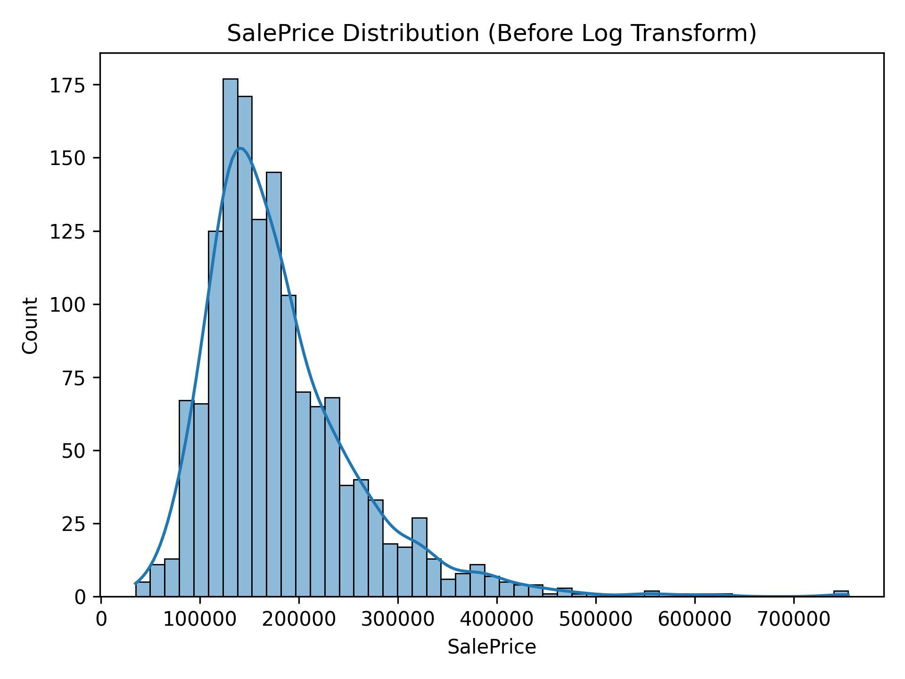
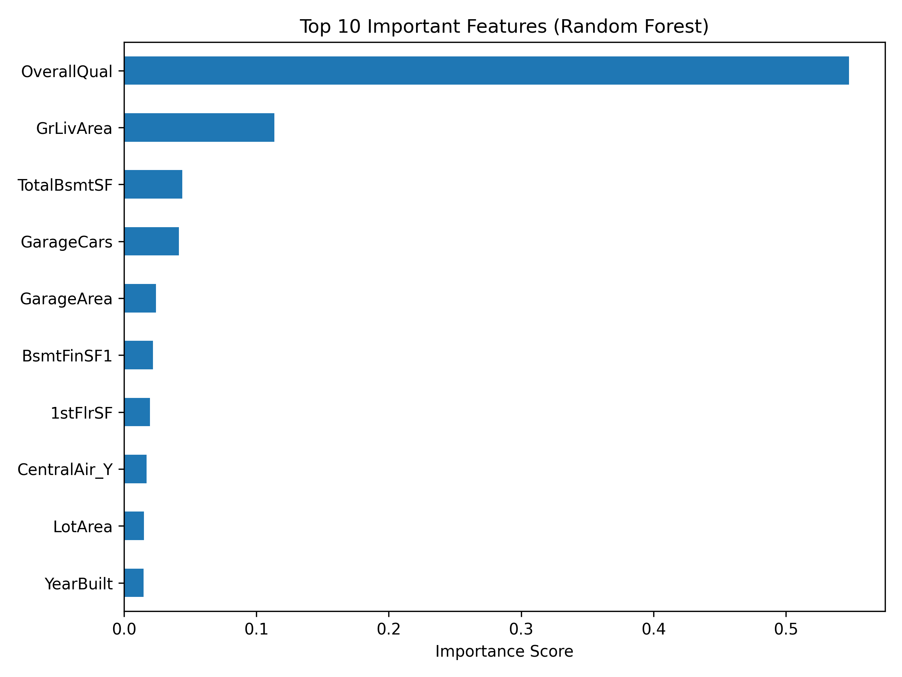

# Machine Learning Analysis of Housing Price Predictors


## Overview

This project applies machine learning techniques to predict residential housing prices using the Ames Housing dataset. The goal was to compare multiple regression models, evaluate their predictive performance, and identify the housing characteristics that have the greatest impact on sale price.

The project includes a complete machine learning pipeline consisting of data preprocessing, feature engineering, model training, evaluation, and feature importance analysis.

---

## Dataset

Ames Housing Dataset

- **Source:** [Kaggle House Prices Competition](https://www.kaggle.com/competitions/house-prices-advanced-regression-techniques)
- **Observations:** 1,460 residential properties
- **Features:** 79 explanatory variables describing physical and structural characteristics of homes

Additional information about each feature is provided in `data_description.txt`.

---

## Project Pipeline

The project follows this machine learning pipeline:

- Log transformation of the target (`SalePrice`) to reduce right skew
- One-hot encoding of categorical features
- Median imputation for missing numerical values
- 80/20 train-test split
- Feature scaling for linear models using `StandardScaler`
- Model training and evaluation
- Random Forest feature importance analysis

### Why Log-Transform `SalePrice`?

The target variable (`SalePrice`) is right-skewed due to a number of high-value homes. Before training the models, a log transformation was applied to reduce skewness and improve model performance.



---

## Models Compared

- Linear Regression
- Ridge Regression
- Lasso Regression
- Random Forest Regressor

---

## Evaluation Metrics

Models were evaluated using:

- Root Mean Squared Error (RMSE)
- Mean Absolute Error (MAE)

---

## Results

Among the evaluated models, the Random Forest Regressor achieved the best overall predictive performance. The table below compares the evaluation metrics for each model.

| Model | RMSE | MAE |
| --- | ---: | ---: |
| Linear Regression | 0.2168 | 0.0972 |
| Ridge Regression | 0.1998 | 0.0967 |
| Lasso Regression | 0.1636 | 0.0970 |
| Random Forest Regressor | 0.1472 | 0.1001 |

### Which Housing Features Are Most Important?

The Random Forest model was used to measure feature importance, identifying the variables that contributed most to predicting housing sale price.

`OverallQual` was the strongest predictor, followed by `GrLivArea`, `TotalBsmtSF`, and `GarageCars`.



---

## Technologies Used

- Matplotlib
- NumPy
- pandas
- Python
- scikit-learn
- Seaborn

---

## Project Structure

```text
Housing-Price-Prediction/
│
├── data/
│   ├── data.csv
│   └── data_description.txt
│
├── figures/
│   ├── saleprice_distribution.png
│   └── feature_importance.png
│
├── report/
│   └── Housing_Price_Prediction_Report.pdf
│
├── main.py
├── README.md
└── requirements.txt
```

---

## How to Run

Clone the repository:

```bash
git clone https://github.com/JayPeeBee825/house-price-prediction
```

Navigate to the project directory:

```bash
cd house-price-prediction
```

Install the required dependencies:

```bash
pip install -r requirements.txt
```

Run the project:

```bash
python main.py
```

---

## Documentation

A complete project report describing the project's methodology, preprocessing steps, model selection, evaluation metrics, results, and conclusions is included in:

- `report/Housing_Price_Prediction_Report.pdf`

---
